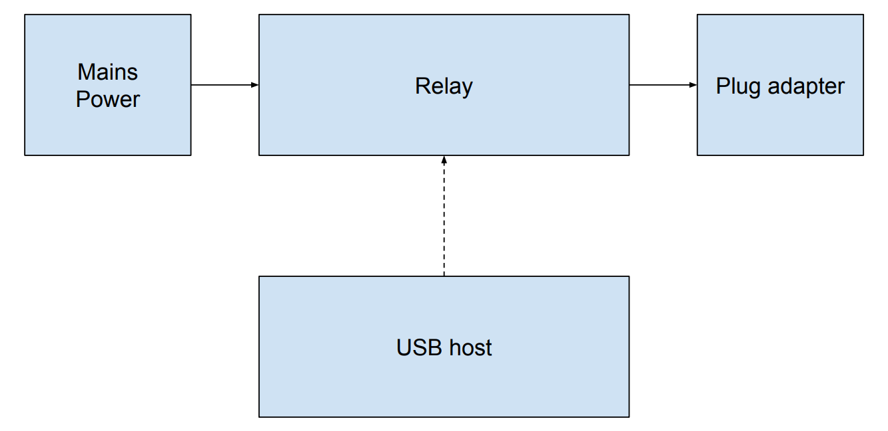

# Automation kit usb relay

This repo contains the files needed to source components and assemble the USB relay device that is to be used as part of the automation kit suite. 



The device is built around an off the shelf USB relay, with an enclosure built around it for both safety and ease of use.

To control the USB relay, the following tool can be used: https://github.com/darrylb123/usbrelay
The quickest way to use it is to install the package:

```
sudo apt-get install usbrelay
```

Check your device's serial number:

```
sudo usbrelay
```

Example output:

```
root@a6a7c99:/usr/src/app# usbrelay HURTM_1=0
Orig: HURTM, Serial: HURTM, Relay: 1 State: fd
Device Found
  type: 16c0 05df
  path: /dev/hidraw0
  serial_number:
  Manufacturer: www.dcttech.com
  Product:      USBRelay2
  Release:      100
  Interface:    0
  Number of Relays = 2
Serial: HURTM, Relay: 1 State: fd
1 HID Serial: HURTM Serial: HURTM, Relay: 1 State: fd

Serial: HURTM, Relay: 1 State: fd --- Found
```

And then toggle it with:
```
sudo usbrelay HURTM_1=0
```

## Capabilities

- Toggle mains power via USB

## Interface

### Hardware

- C14 power input to connect to mains
- C13 output to connect to plug adapter for country/region its being used in
- USB B to connect to the host that will control the relay

### Software

- Open source control library: https://github.com/darrylb123/usbrelay
- Enables command line control, or Python library